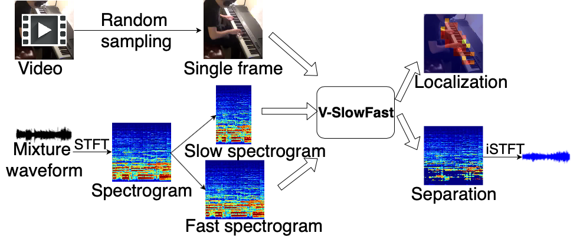
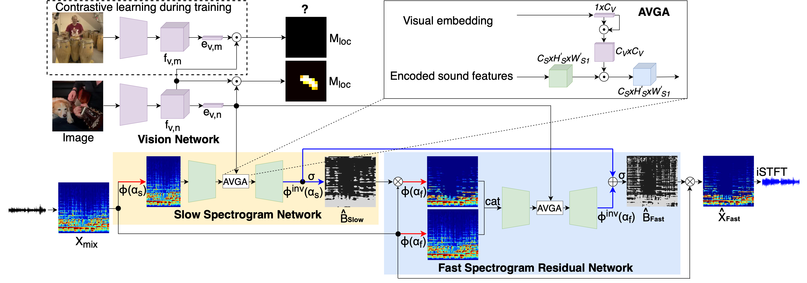
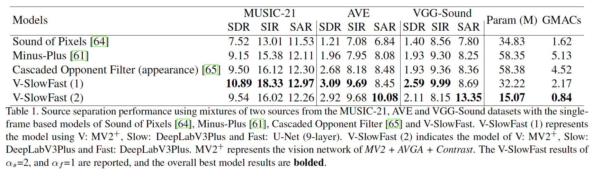

[Paper](https://arxiv.org/abs/2109.08867) | [Code **Coming soon**]()
<!-- [[Code **Coming soon.**]](...) -->

# Abstract
The objective of this paper is to perform visual sound separation: i) we study visual sound separation on spectrograms of different temporal resolutions; ii) we propose a new light yet efficient three-stream framework V-SlowFast that operates on Visual frame, Slow spectrogram, and Fast spectrogram. The Slow spectrogram captures the coarse temporal resolution while the Fast spectrogram contains the fine-grained temporal resolution; iii) we introduce two contrastive objectives to encourage the network to learn discriminative visual features for separating sounds; iv) we propose an audio-visual global attention module for audio and visual feature fusion; v) the introduced V-SlowFast model outperforms previous state-of-the-art in single-frame based visual sound separation on small- and large-scale datasets: MUSIC-21, AVE, and VGG-Sound. We also propose a small V-SlowFast architecture variant, which achieves 74.2% reduction in the number of model parameters and 81.4% reduction in GMACs compared to the previous multi-stage models.

## Architecture

The goal of the visual sound separation is to extract the component audio that corresponds to the sound source in the given visual frame. The proposed V-SlowFast network contains four components: vision network, audio-visual global attention module, slow spectrogram network, and fast spectrogram residual network. The vision network randomly extracts a single frame from the input video sequence and encodes it into a feature vector. To enhance the discrimination between semantic categories, we randomly sample an additional visual frame from a same (positive) or different (negative) category video to make contrastive pairs during the training procedure. We apply two visual contrastive objectives (embedding and localization) to the contrastive pairs along the vision network. The audio-visual global attention module fuses the visual embedding with sound features. The slow spectrogram network performs source separation at the coarse time scale (low sampling rate) using appearance features. The obtained result and the original mixture are further passed to the fast spectrogram residual network, which refines the source separation using spectrogram with higher temporal resolution (high sampling rate).

## Source separation performance in comparison with recent works

The reported results summarize the performance in comparison with recent single frame methods Sound of Pixels [64], Minus-Plus [61] and Cascaded Opponent Filter (COF) [65] on MUSIC-21, AVE and VGGSound datasets using mixtures of two sound sources (N=2).

<!--  -->
