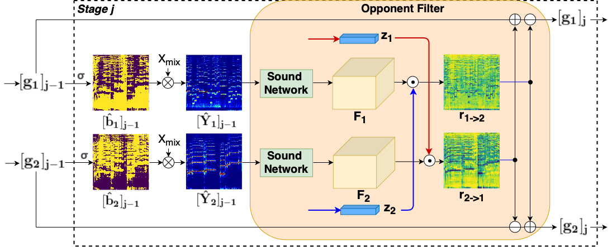
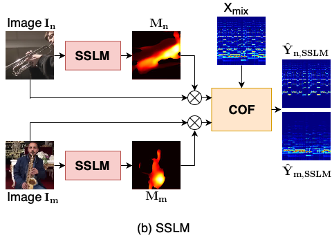

[Paper](https://arxiv.org/pdf/2006.03028.pdf) | [Code **Coming soon.**]() | [ACCV2020]
<!-- [[Code **Coming soon.**]](https://github.com/ly-zhu/cof-net) -->

# Abstract
The objective of this paper is to recover the original component signals from a mixture audio with the aid of visual cues of the sound sources. Such task is usually referred as visually guided sound source separation. The proposed Cascaded Opponent Filter (COF) framework consists of multiple stages, which recursively refine the source separation. A key element in COF is a novel opponent filter module that identifies and relocates residual components between sources. The system is guided by the appearance and motion of the source, and, for this purpose, we study different representations based on video frames, optical flows, dynamic images, and their combinations. Finally, we propose a Sound Source Location Masking (SSLM) technique, which, together with COF, produces a pixel level mask of the source location. The entire system is trained in an end-to-end manner using a large set of unlabelled videos. We compare COF with recent baselines and obtain the state-of-the-art performance in three challenging datasets (MUSIC, A-MUSIC, and A-NATURAL).

## The Architecture of COF-Net
<!--  -->


The overall architecture of the proposed Cascaded Opponent Filter (COF) network. COF operates in multiple stages. The first stage contains three components: 1) a sound network that splits the input spectrogram into a set of feature maps; 2) a vision network that converts the input video sequences into compact representations; and 3) a sound separator that produces spectrograms of the component audios (one per video) based on the outputs of the sound and vision networks. The second stage contains similar sound and vision networks as the first one (internal details may differ). However, instead of the sound separator, the second stage contains a special opponent filter (OF) module, which enhances the separation result by transferring sound components between the sources. The output of the filter is passed to the next stage or used as the final output. The following stages are identical to the second one and, for this reason, we refer our method as cascaded opponent filter (COF) network. The final component audios are produced by applying the inverse STFT to the component spectrograms.


## Vision Network
<!--  -->


The vision network aims at converting the input video sequence (or keyframe) into a compact representation that contains the necessary information of the sound source. Sometimes already a pure appearance of the source (e.g. instru- ment type) might be sufficient, but, in most cases, the motions are vital cues to facilitate the source separation (e.g. hand motion, mouth motion, etc.). The appropriate representation may have high model/computation complexity and, to seek for a balance between computational complexity and performance, we study several visual representation options. 


## Opponent Filter (OF)
<!--  -->


<!-- The Opponent Filter (OF) module identifies and relocates residual components between sound sources based on appearance and motion information of all videos.  -->

The main idea in the Opponent Filter (OF) module is to use visual representation of the source n to identify spectrum components from the source m that should belong to source n but are currently assigned to m. These are then transferred from source m to n. The motivation behind the construction is to utilise all visual representations z1,...,zn to determine each component audio, instead of using only the corresponding one.


## Sound Source Location Masking Network (SSLM)
<!--  -->


Sound Source Location Masking (SSLM) network identifies a minimum set of input pixels, for which the COF-Net would produce almost identical output as for the entire image. The SSLM is trained together with the overall model. The input video frames are first passed through the SSLM component which outputs a weighted location mask [0,1] having same spatial size as the input frame. The input video frames are multiplied element-wise with the mask, and the result is passed to the COF model.


## Examples of Sound Source Separation
<!--  -->


## Examples of Sound Source Localization
<!--  -->


<!--
## Paper
<blockquote class="embedly-card"><h4><a href="https://arxiv.org/abs/2006.03028">Visually Guided Sound Source Separation using Cascaded Opponent Filter Network</a></h4><p>The objective of this paper is to recover the original component signals from a mixture audio with the aid of visual cues of the sound sources.</p></blockquote>
<script async src="//cdn.embedly.com/widgets/platform.js" charset="UTF-8"></script>
-->

<!-- 
## Code 
**Coming soon.**
-->

<!--<iframe width="360" height="315" src="https://arxiv.org/abs/2006.03028"></iframe> -->

## Citation
```bibtex   
    @misc{zhu2020visually,
        title={Visually Guided Sound Source Separation using Cascaded Opponent Filter Network},
        author={Lingyu Zhu and Esa Rahtu},
        year={2020},
        eprint={2006.03028},
        archivePrefix={arXiv},
        primaryClass={cs.CV}
    }
```


<!--  -->
