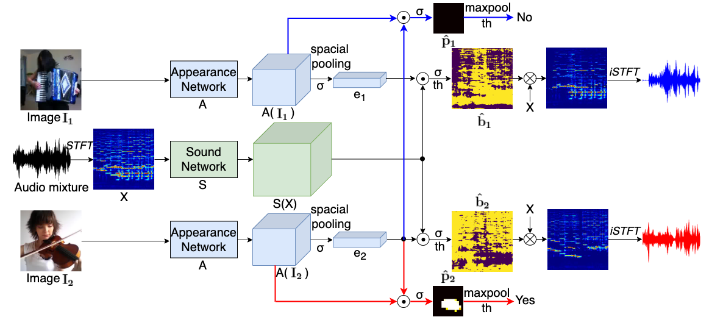
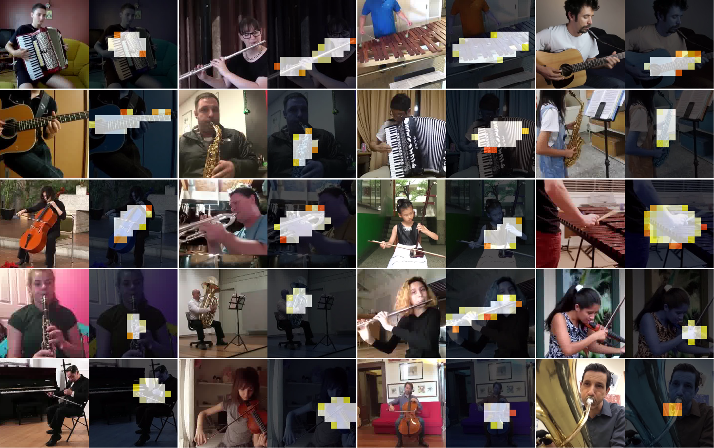
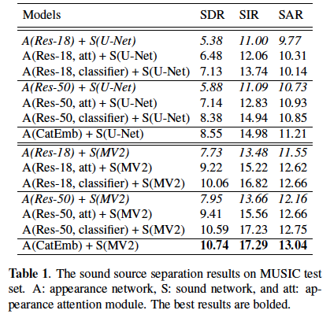
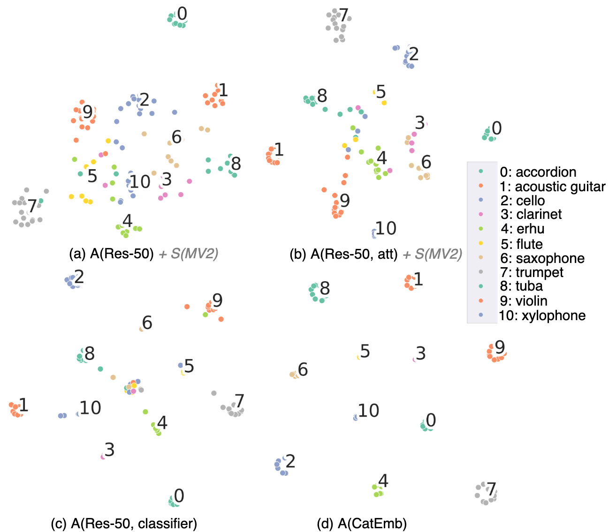

[Paper](https://arxiv.org/pdf/2007.07984.pdf) | [Code](https://github.com/ly-zhu/Leveraging-Category-Information-for-Single-Frame-Visual-Sound-Source-Separation)


# Abstract
Visual sound source separation aims at identifying sound components from a given sound mixture with the presence of visual cues. Prior works have demonstrated impressive results, but with the expense of large multi-stage architectures and complex data representations (e.g. optical flow trajectories). In contrast, we study simple yet efficient models for visual sound separation using only a single video frame. Furthermore, our models are able to exploit the information of the sound source category in the separation process. To this end, we propose two models where we assume that i) the category labels are available at the training time, or ii) we know if the training sample pairs are from the same or different category. The experiments with the MUSIC dataset show that our model obtains comparable or better performance compared to several recent baseline methods. 


## The framework of single frame visual sound source separation and localization system
<!--  -->


The framework of single frame visual sound source separation and localization system. The appearance network A converts the input image I (a random frame of a sequence video) to visual feature maps A(I) and further, with a spacial pooling, to a compact representation e. The sound network S splits the mixture spectrogram X into a set of feature maps S(X). A linear combination of appearance representation e and sound features maps S(X) produces a sound separation mask b. The appearance attention module (red and blue arrows) is formed by a scalar product between the appearance representation e and appearance feature maps A(I). The appearance attention module produces a source location mask p.


## Examples of Sound Source Separation
<!--  -->


## Examples of Sound Source Localization
<!--  -->



## Sound Source Separation Results
<!--  -->


## Sound Source Separation with Appearance Network
We combine the appearance network A of Res-18 and Res-50 with sound network S of U-Net and MV2 as four models to compare against: A(Res-18) + S(U-Net), A(Res-18) + S(MV2), A(Res-50) + S(U-Net), and A(Res-50) + S(MV2). We report the corresponding sound separation metrics in Table1 (italic).

## Sound Source Separation with Appearance Attention Module
As is shown in Table 1, with the same appearance network, the higher capacity the sound network has, the better performance
the system achieves, e.g. moving from A(Res-18) + S(U-Net) to A(Res-18) + S(MV2) results in SDR: 2.35dB performance improvement. However, with the same sound network, having the appearance network of higher capacity results in similar performance improvement, e.g. the improvement from A(Res-18) + S(MV2) to A(Res-50) + S(MV2) is only SDR: 0.22dB. Thus, we hypothesize that the appearance embedding that predicted from the appearance network could be further improved for sound separation.

To study this, we introduced a light yet efficient appearance attention module to emphasize the semantic distinction of the learned appearance embeddings. We assess the performance of the appearance attention module (denoted as att) for the sound separation task in Table 1. The improvement, e.g. SDR: 1.49dB, of A(Res-18, att) + S(MV2) compared to its counterpart A(Res-
18) + S(MV2), indicates a clear advantage from the appearance attention module.

## Sound Source Separation using Category Embeddings
We investigate how the category information alone could aid for the sound source separation. For this purpose, we encode the known source category information of a visual frame into binary embedding, namely, Category Embedding (CatEmb). The CatEmb will be a replacement of the learned appearance embedding e from appearance network. At the training phase, we adopt the CatEmb as the appearance cues to separate the target sound components from the sound mixture with the sound network. As is shown in Table 1, with the CatEmb, the sound network of U-Net and MV2 attain the performance of 8.55dB and 10.74dB in SDR respectively. The results suggest how much the existing appearance network could be further improved.

## Sound Source Separation with Appearance Classifier
How far could we push the appearance network embedding towards the CatEmb? To answer this question, we first train an appearance classifier when providing the category information, and then adopt it for the sound separation task. Its quantitative result is reported in Table 1. With the appearance classifier, the system pushes its sound separation performance
further towards the models that use CatEmb, e.g. the scores of SDR: 10.59 of A(Res-50, classifier) + S(MV2) in comparison
with the SDR: 10.74 of A(CatEmb) + S(MV2). 

## Visualization of Visual Embedding
<!--  -->


We take the framework of A(Res-50) + S(MV2) as an example to visualize the appearance embedding on different conditions (e.g. appearance network, appearance attention, appearance classifier, and CatEmb) with t-SNE in Fig. 3. As we can see, the compactness of both the intra- and inter-class of A(Res-50) embedding is limited. From the A(Res-50) to A(Res-50, att), and A(Res-50, classifier), the learned appearance embedding is pushed more close to the CatEmb in Fig. 3(d).


<!--
## Paper
<blockquote class="embedly-card"><h4><a href="https://arxiv.org/abs/2006.03028">Visually Guided Sound Source Separation using Cascaded Opponent Filter Network</a></h4><p>The objective of this paper is to recover the original component signals from a mixture audio with the aid of visual cues of the sound sources.</p></blockquote>
<script async src="//cdn.embedly.com/widgets/platform.js" charset="UTF-8"></script>
-->

<!-- 
## Code 
**Coming soon.**
-->

<!--<iframe width="360" height="315" src="https://arxiv.org/abs/2006.03028"></iframe> -->

## Citation
```bibtex   
    @misc{zhu2020separating,
    title={Separating Sounds from a Single Image},
    author={Lingyu Zhu and Esa Rahtu},
    year={2020},
    eprint={2007.07984},
    archivePrefix={arXiv},
    primaryClass={cs.CV}
}
```


<!--  -->
