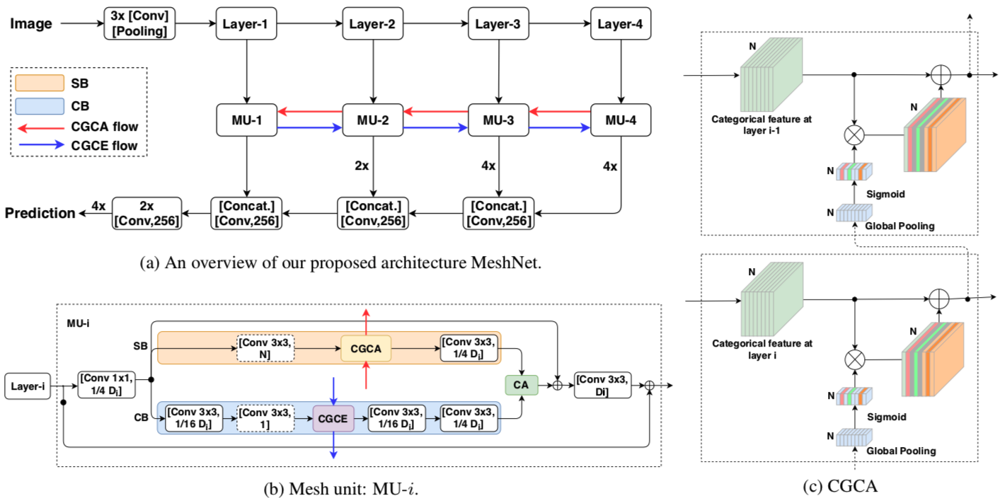
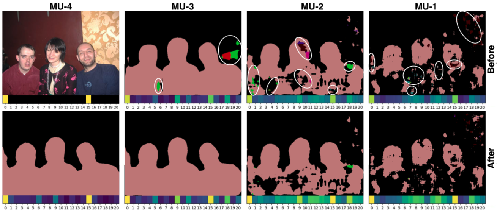
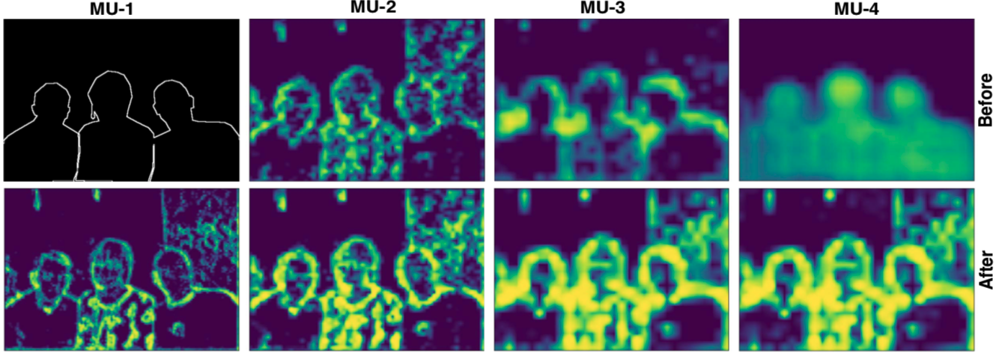
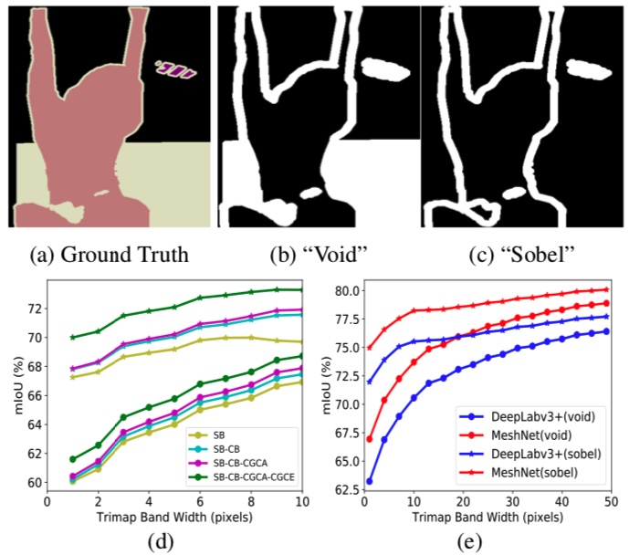
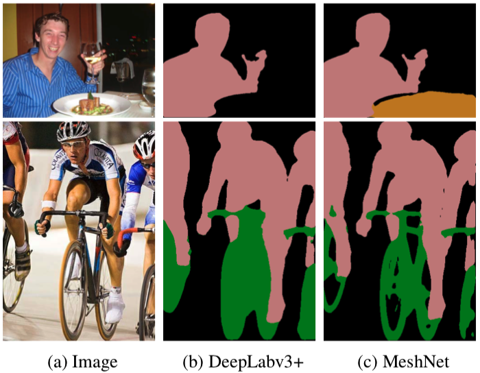
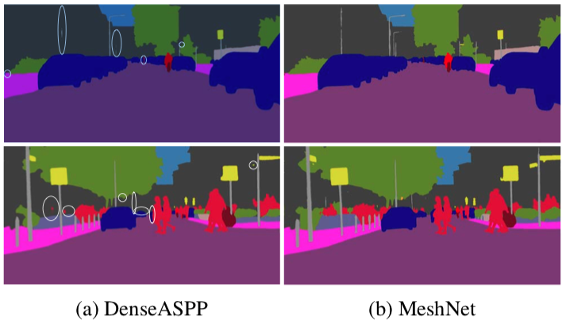

[[Paper]](https://openaccess.thecvf.com/content_ICCVW_2019/papers/NeurArch/Zhu_Cross-Granularity_Attention_Network_for_Semantic_Segmentation_ICCVW_2019_paper.pdf)
<!-- [[Code **Coming soon.**]]() -->
<!-- [[Code **Coming soon.**]](https://github.com/ly-zhu/cof-net) -->

# Abstract
Despite the remarkable progress of semantic segmentation in recent years, much remains to be addressed in order to achieve better semantic coherence and boundary delineation. In this paper, we propose a novel convolutional neural network (CNN) architecture for semantic segmentation which explicitly addresses these two issues. Specifically, we propose a categorical attention mechanism to propagate consistent category-oriented information across multi-granularity contextual interpretations to close the semantic gap residing in CNN feature hierarchy. This novel design alleviates the semantic information loss during the feature combination and transformation process in decoder network. We further integrate a contour branch in our architecture to enhance the boundary awareness of the semantic feature derived in the form of a novel element-wise contour attention at each level of feature hierarchy. Additionally, we introduce a cross-granularity contour enhancement mechanism to propagate rich boundary cues from early layers to deep layers. We perform extensive quantitative evaluations in close proximity to object boundaries which confirms its superior effectiveness in boundary delineation. These novel mechanisms which boost the essentials in segmentation, i.e., region-wise semantic coherence and accurate object contour localization, allow our architecture “MeshNet” to obtain state-of-the-art performance on two challenging datasets, i.e., PASCAL VOC 2012 and Cityscapes.

## Architecture of MeshNet
<!--  -->


(a) An overview of our proposed architecture MeshNet. Four mesh units MU-i take as input of the feature maps from encoder, which propagate consistent categorical information (red arrows) in a top-down manner across feature hierarchy and explicitly enhance boundary awareness of semantic features by incorporating contour features (blue arrows) from early hierarchy. (b) Architecture of MU-i. In each MU-i, the feature maps from Layer-i are fed into two branches, i.e., semantic branch (SB) and contour branch (CB). The features from two branches are fused by an element-wise Contour Attention (CA) module to explicitly enhance the semantic boundary awareness at each feature hierarchy. The dashed blocks in each MU-i are associated with the auxiliary loss functions defined in Section 3.5 during training. (c) Architecture of proposed CGCA module. CGCA: Cross-Granularity Categorical Attention, and CGCE: Cross-Granularity Contour Enhancement.

## Intermediate Semantic Predictions before and after CGCA
<!--  -->


Intermediate semantic predictions before (top row) and after (bottom row) CGCA. The corresponding attention weight vector below each label map demonstrates the efficacy of the proposed architecture where the semantic ambiguity issue residing in the lower-level features is effectively resolved and the categorical feature becomes more attentive on consistent categories, i.e. background (0) and people (15) in this example.

## Intermediate Contour Predictions before and after CGCE
<!--  -->


Intermediate contour predictions before (top row) and after (bottom row) CGCE. CGCE enhances the boundary awareness of the deeper layer features, especially the boundary attention of MU-4.

## Performance Evaluation along Object Boundaries with Trimap Bands
<!--  -->


(a) Ground truth. (b) “Void” 20-pixel trimap. (c) “Sobel” 20-pixel trimap. (d) mIoU accuracy of architecture components from ablation studies with varying width of trimap band. The encoder “Xception65” is omitted here, and “void” boundary is marked as “◦”, “sobel” boundary is marked as “⋆”. (e) mIoU accuracy (with MS-COCO pre-training) of our MeshNet and DeepLabv3+ with varying width of trimap band.


## Example Results on PASCAL VOC 2012 Dataset
<!--  -->



## Example Results on Cityscapes Dataset
<!--  -->



<!--
## Paper
<blockquote class="embedly-card"><h4><a href="https://arxiv.org/abs/2006.03028">Visually Guided Sound Source Separation using Cascaded Opponent Filter Network</a></h4><p>The objective of this paper is to recover the original component signals from a mixture audio with the aid of visual cues of the sound sources.</p></blockquote>
<script async src="//cdn.embedly.com/widgets/platform.js" charset="UTF-8"></script>
-->

<!-- 
## Code 
**Coming soon.**
-->

<!--<iframe width="360" height="315" src="https://arxiv.org/abs/2006.03028"></iframe> -->

## Citation
```bibtex 
@InProceedings{Zhu_2019_ICCV,
author = {Zhu, Lingyu and Wang, Tinghuai and Aksu, Emre and Kamarainen, Joni-Kristian},
title = {Cross-Granularity Attention Network for Semantic Segmentation},
booktitle = {Proceedings of the IEEE/CVF International Conference on Computer Vision (ICCV) Workshops},
month = {Oct},
year = {2019}
}
```


<!--  -->
