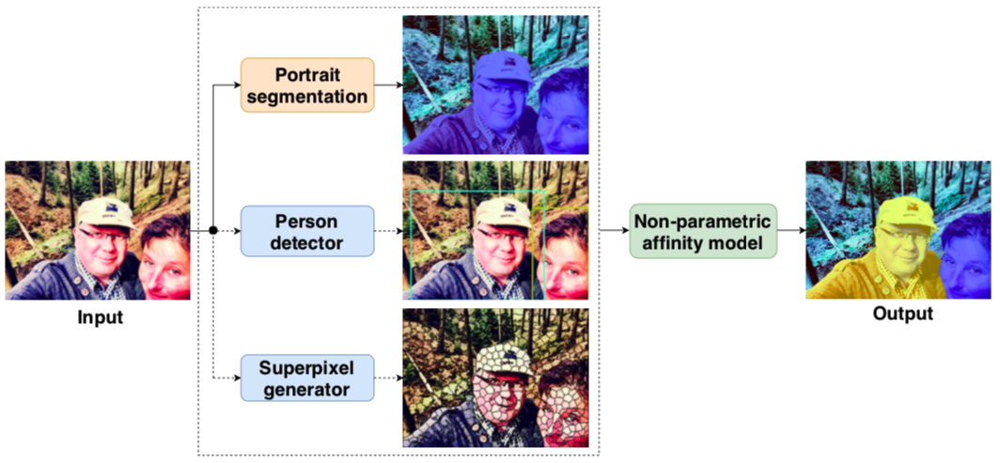
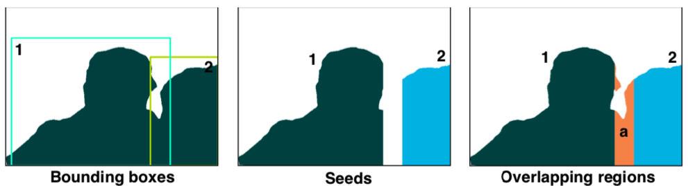
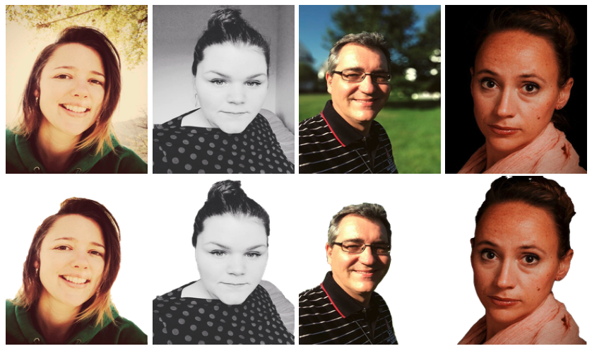

[[Paper]](https://ieeexplore.ieee.org/abstract/document/8785021)
<!-- [[Code **Coming soon.**]]() -->
<!-- [[Code **Coming soon.**]](https://github.com/ly-zhu/cof-net) -->

# Abstract
Accurate and efficient portrait instance segmentation has become a crucial enabler for many multimedia applications on mobile devices. We present a novel convolutional neural network (CNN) architecture to explicitly address the long standing problems in portrait segmentation, i.e., semantic coherence and boundary localization. Specifically, we propose a cross-granularity categorical attention mechanism leveraging the deep supervisions to close the semantic gap of CNN feature hierarchy by imposing consistent category-oriented information across layers. Furthermore, a cross-granularity boundary enhancement module is proposed to boost the boundary awareness of deep layers by integrating the shape context cues from shallow layers of the network. We further propose a novel and efficient non-parametric affinity model to achieve efficient instance segmentation on mobile devices. We present a portrait image dataset with instance level annotations dedicated to evaluating portrait instance segmentation algorithms. We evaluate our approach on challenging datasets which obtains state-of-the-art results.

## Architecture
<!--  -->


The multi-person photo is firstly processed by a portrait segmentation network, a person detector and a superpixel generator, producing person/non-person labels, person bounding boxes and superpixels respectively. The instance segmentation is sequentially produced by the proposed non-parametric affinity model.

## Example of Overlapping Bounding Boxes
<!--  -->


The left figure illustrates the portrait segmentation map and detected person instances associated to bounding boxes. The middle figure shows the generated seeds for each person instance (i.e., known identity) and the right figure shows the overlapping regions which comprise pixels with unknown identities.


## Examples of Portrait Segmentation
<!--  -->



## Examples of Portrait Instance Segmentation 
<!--  -->


<!--
## Paper
<blockquote class="embedly-card"><h4><a href="https://arxiv.org/abs/2006.03028">Visually Guided Sound Source Separation using Cascaded Opponent Filter Network</a></h4><p>The objective of this paper is to recover the original component signals from a mixture audio with the aid of visual cues of the sound sources.</p></blockquote>
<script async src="//cdn.embedly.com/widgets/platform.js" charset="UTF-8"></script>
-->

<!-- 
## Code 
**Coming soon.**
-->

<!--<iframe width="360" height="315" src="https://arxiv.org/abs/2006.03028"></iframe> -->

## Citation
```bibtex 
@inproceedings{zhu2019portrait,
  title={Portrait instance segmentation for mobile devices},
  author={Zhu, Lingyu and Wang, Tinghuai and Aksu, Emre and Kamarainen, Joni-Kristian},
  booktitle={2019 IEEE International Conference on Multimedia and Expo (ICME)},
  pages={1630--1635},
  year={2019},
  organization={IEEE}
}
```


<!--  -->
