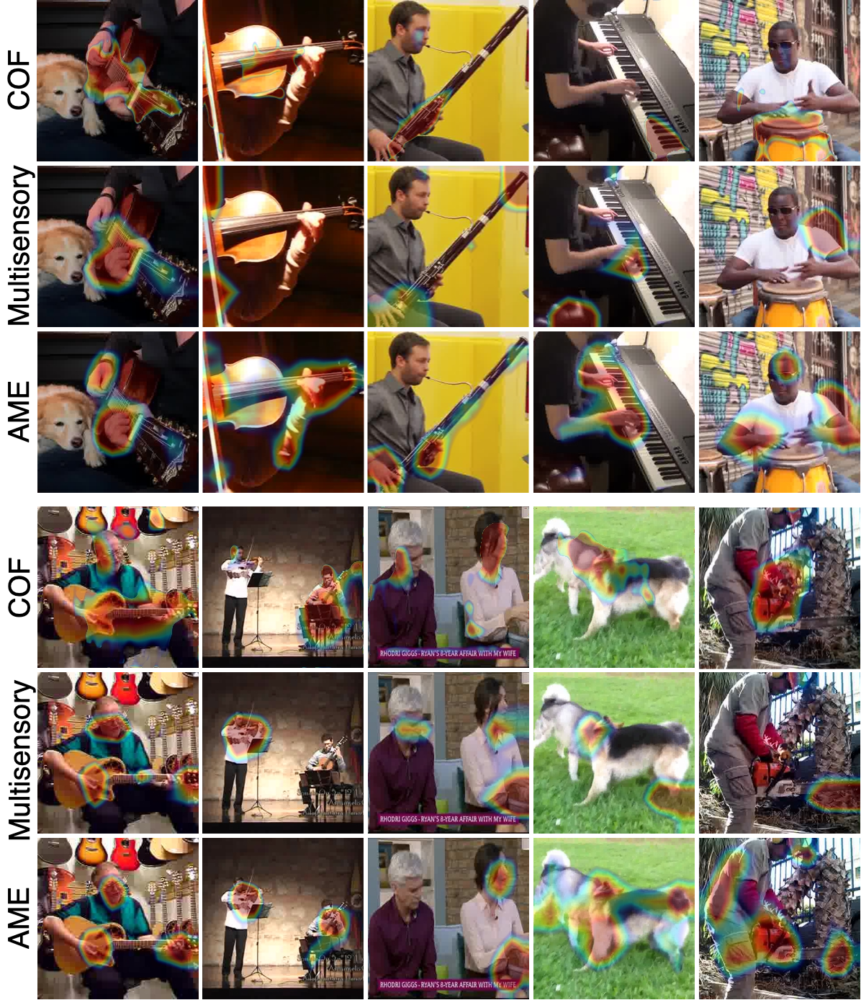
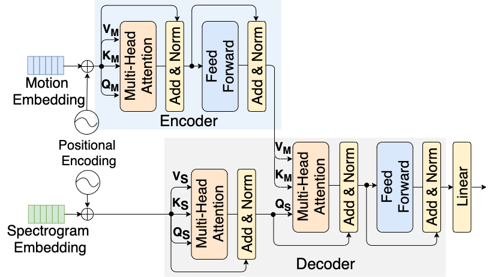
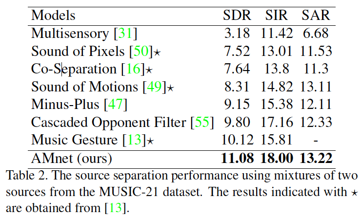

[Paper](https://arxiv.org/pdf/2007.07984.pdf) | [[Code **Coming soon**]]]()
<!-- [[Code **Coming soon.**]](...) -->

# Abstract
The objective of this paper is to perform audio-visual sound source separation, i.e. to separate component audios from a mixture based on the videos of sound sources. Moreover, we aim to pinpoint the source location in the input video sequence. Recent works have shown impressive audio-visual separation results when using prior knowledge of the source type (e.g. human playing instrument) and pre-trained motion detectors (e.g. keypoints or optical flows). However, at the same time, the models are limited to a certain application domain. In this paper, we address these limitations and make the following contributions: i) we propose a two-stage architecture, called Appearance and Motion network (AMnet), where the stages specialise to appearance and motion cues, respectively. The entire system is trained in a self-supervised manner; ii) we introduce an Audio-Motion Embedding (AME) framework to explicitly represent the motions that related to sound; iii) we propose an audio-motion transformer architecture for audio and motion feature fusion; iv) we demonstrate state-of-the-art performance on two challenging datasets (MUSIC-21 and AVE) despite the fact that we do not use any pre-trained keypoint detectors or optical flow estimators.

## Examples of Separating different type of sources


## Examples of Separating same type of sources


## Examples of Sound Source Localization



## The overall architecture of the proposed Appearance and Motion network (AMnet)


The overall architecture of the proposed Appearance and Motion network (AMnet). The Audio-Appearance stage encodes a video keyframe and a mixture audio spectrogram into an appearance feature vector and a spectrum feature volume, respectively. These are subsequently fused by calculating a weighted sum of spectrum features using appearance features as weights. The result is further converted to a binary mask and multiplied with the input spectrogram to produce the separated output. The Audio-Motion stage again encodes the spectrograms and the video sequence into feature representations. These are fused with the proposed Audio-Motion Transformer module, decoded, and passed to produce a refined mask, which is multiplied with the input mixture spectrogram to produce the final output.


## Audio-Motion Embedding Framework


The proposed Audio-Motion Embedding (AME) framework exploits the natural correlation between the audio and motion of a natural video. The AME framework (see Figure~\ref{fig:AVTA}) consists of Motion Network and Sound Network, which map the motion and audio sequences into a common embedding space, respectively. We formulate the learning objectives to enforce small embedding distances between well synchronised streams and large distances for out-of-sync streams. We hypothesize that this learning objective encourages the Motion Network to focus mainly on the sound related motion features in the input video. 


The AME maps the motions and audio into the common embedding space. The mappings are learned in the following manner: i) given a video clip v with an aligned audio x_aligned, we generate a misaligned audio x_misaligned by randomly shifting the waveform in time domain; ii) we encode the video stream, aligned audio, and the misaligned audio into embedding representations using the motion and sound networks, respectively; iii) we calculate the distances between the video embedding and the both audio embeddings, and formulate a cost function using a triplet loss approach; and iv) we optimise the embedding networks by minimizing the loss function over a large set of videos. 


Previous works using audio-visual synchronization for self-supervised representation learning formulate the problem as a classification task where the system decides if the given audio and video are synchronized (1) or not (0). Moreover, the information along the temporal dimension is mostly neglected by marginalizing the corresponding dimension with pooling operation. In contrast, we formulate the problem as a mapping from motion and audio domains to a common embedding space, where the distances correlate with the temporal alignment. Moreover, the representation retains the temporal dimension at the output features. 


## Audio-Appearance Sound Source Separation


## Audio-Motion Sound Source Separation


## Audio-Motion Transformer


The Audio-Motion Transformer (AMT) module is used to leverage the obtained motion cues (the motions of sound learned with AME) for sound source separation.

## Sound Source Separation Results



## Citation
```bibtex   
InProceedings{Zhu_2020_ACCV,
    author    = {Zhu, Lingyu and Rahtu, Esa},
    title     = {Visually Guided Sound Source Separation using Cascaded Opponent Filter Network},
    booktitle = {Proceedings of the Asian Conference on Computer Vision (ACCV)},
    month     = {November},
    year      = {2020}
}
```


<!--  -->
