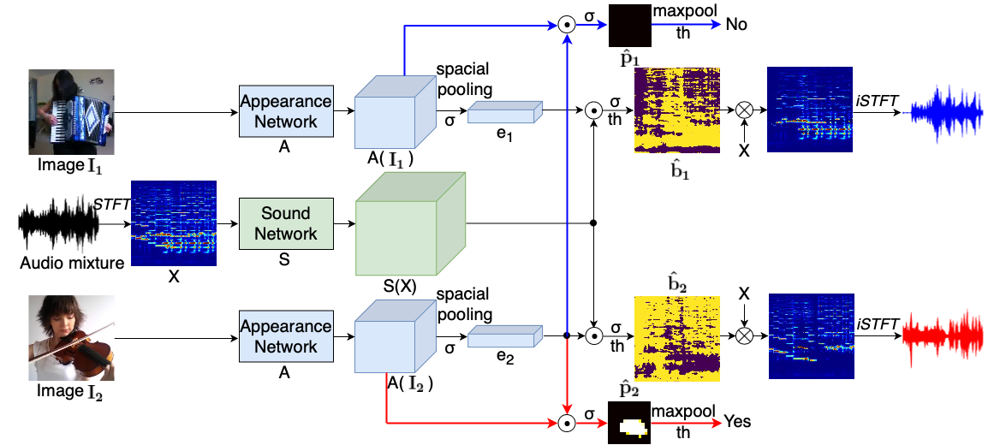
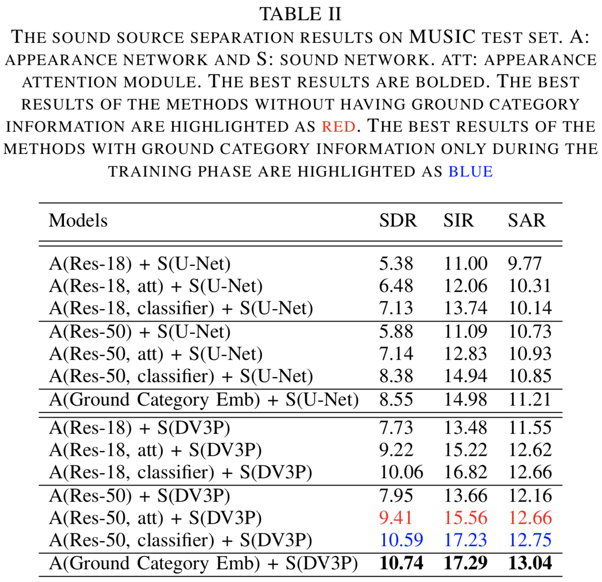
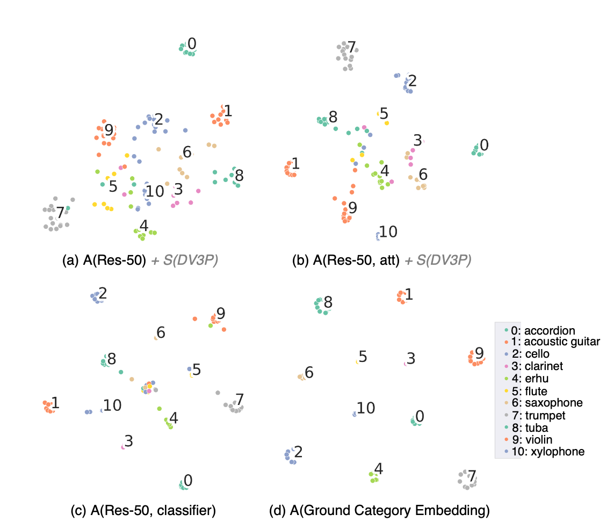
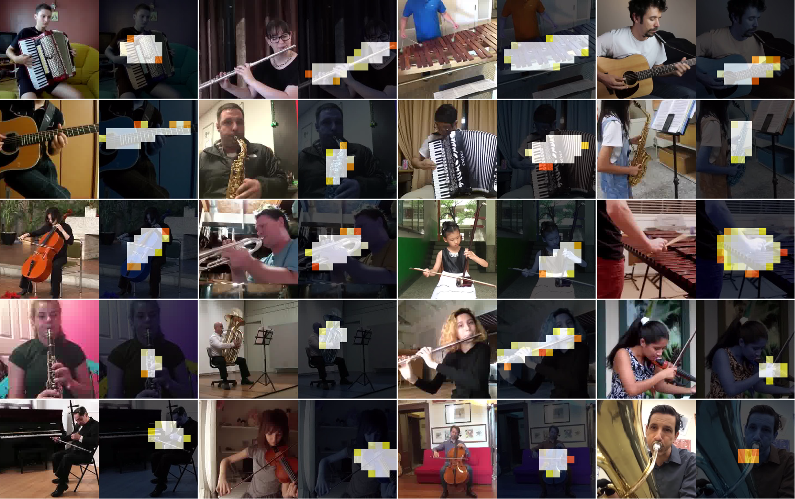

[[Paper]](https://arxiv.org/pdf/2007.07984.pdf)
<!-- [[Code **Coming soon.**]](https://github.com/ly-zhu/cof-net) -->

# Abstract
Recently, visual information has been widely used to aid the sound source separation tasks. It aims at identifying sound components from a given sound mixture with the presence of visual information. Especially, the appearance cues play an important role on separating sounds. However, the capacity of how well the network processes each modality is often ignored. In this paper, we investigate the performance of appearance information, extracted from a single image, in the task of recovering the original component signals from a mixture audio. An efficient appearance attention module is introduced to improve the sound separation performance by enhancing the distinction of the predicted semantic representations, and to precisely locate sound sources without extra computation. Moreover, we utilize the ground category information to study the capacity of each sub-network. We compare the proposed methods with recent baselines on the MUSIC dataset. 


## Architecture of the Appearance-aided Sound Source Separation and Localization System
<!--  -->


The appearance network A converts the input image I (a keyframe of a sequence video) to visual feature maps A(I) and further, with a spacial pooling, to a compact representation e. The sound network S splits the mixture spectrogram X into a set of feature maps S(X). A linear combination of appearance representation e and sound features maps S(X) produces a sound separation mask ˆb. The pixel-wise multiplication between the mask ˆb and input mixture spectrogram X determines the output component spectrogram, which recovers the final separated audio signal by following an inverse Short-time Fourier Tranform (iSTFT). The appearance attention module is formed by a scalar product between the appearance representation e and appearance feature maps A(I). The appearance attention module produces a source location mask pˆ. The red and blue arrows represent the appearance attention module.

## Sound Separation Results
<!--  -->


We introduce an efficient appearance attention module to emphasize the learned semantic distinction (appearance network), which enhances the predicted categorical possibility by predicting whether the appearance embedding and feature maps are from same sources or not. 

The results demonstrate that the proposed appearance attention module is capable of enhancing the semantic distinction. However, there is still a relatively large gap between using appearance network prediction e and the ground categories as semantic cues on the sound separation results. How far can we push the appearance network prediction towards the ground category embedding? To answer this question, we first train an appearance classifier when providing the ground category information, and then adopt it for the sound separation task. With the appearance classifier, the system pushes its sound separation performance further towards the upper bound.


## Visualization of Visual Embedding
<!--  -->


We take the framework of A(Res-50) + S(DV3P) as an example to visualize the learned appearance embedding from the appearance network on different conditions (e.g. appearance attention, appearance classifier, and ground category embedding) with t-SNE. As we can see, the compactness of both the intra- and inter-class of Res-50 embedding is limited. From the Res-50 to Res-50 with appearance attention, and Res-50 classifier, the learned appearance embedding is pushed more close to the ground category embedding.

## Examples of Sound Source Separation
<!--  -->


## Examples of Sound Source Localization
<!--  -->



<!--
## Paper
<blockquote class="embedly-card"><h4><a href="https://arxiv.org/abs/2006.03028">Visually Guided Sound Source Separation using Cascaded Opponent Filter Network</a></h4><p>The objective of this paper is to recover the original component signals from a mixture audio with the aid of visual cues of the sound sources.</p></blockquote>
<script async src="//cdn.embedly.com/widgets/platform.js" charset="UTF-8"></script>
-->

<!-- 
## Code 
**Coming soon.**
-->

<!--<iframe width="360" height="315" src="https://arxiv.org/abs/2006.03028"></iframe> -->

## Citation
```bibtex   
    @misc{zhu2020Separating,
        title={Separating Sounds from a Single Image},
        author={Lingyu Zhu and Esa Rahtu},
        year={2020},
        eprint={2007.07984},
        archivePrefix={arXiv},
        primaryClass={cs.CV}
    }
```


<!--  -->
